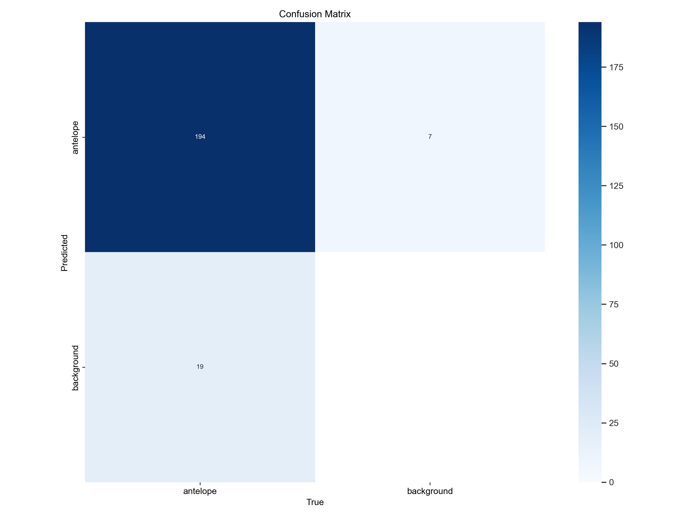
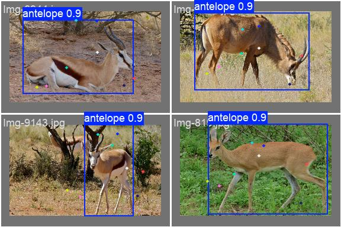

# Descrição do Problema
O trabalho proposto consiste em desenvolver uma pipeline de _pose estimation_ para animais. 
A solução foi dividida em 4 etapas:
- Preparação e pré-processamento dos dados.
- Treinamento do modelo YoloV8.
- Recebimento dos resultados.
- Análise e interpretação dos resultados.

# Estrutura do Desenvolvimento

**Diretórios principais:**
- **antelope**: Arquivos relacionados.
- **inference_results**: Resultados das inferências.
- **results**: Resultados finais.
- **runs**: Logs e checkpoints.
- **test_images**: Imagens para teste.
- **train_data**: Dados de treinamento.

**Arquivos importantes:**
- `antelope.json`
- `antelope_pose.yaml`
- `notebook.ipynb`
- `README.md`
- `train_data.cache`
- `yolov8n-pose-antelope.pt`
- `yolov8n-pose.pt`

# Resultados

Os resultados indicam que o modelo teve excelente desempenho na detecção (bounding box) dos animais, alcançando 90% no mAP. Entretanto, a _pose estimation_ teve desempenho inferior, com apenas 2%. Abaixo, veja os principais detalhes:

      Epoch    GPU_mem   box_loss  pose_loss  kobj_loss   cls_loss   dfl_loss  Instances       Size
       7/30         0G      1.307      8.169     0.6764      1.047      1.329         28        256: 100%|██████████| 19/19 [00:11<00:00,  1.64it/s]
                 Class     Images  Instances      Box(P  R  mAP50  mAP50-95)     Pose(P  R  mAP50  mAP50-95): 100%|██████████| 10/10 [00:06<00:00,  1.61it/s]
                   all        152        213       0.89      0.812        0.9      0.631       0.15     0.0751     0.0267    0.00367

**Matriz de Confusão:**

**Exemplos com Imagens Reais:**

# Melhorias Futuras

A fim de aprimorar os resultados do modelo, recomenda-se aumentar o número de amostras para o treinamento, o que permite uma maior diversidade dos dados. Além disso, utilizar anotações mais precisas pode contribuir significativamente para a melhoria da _pose estimation_.